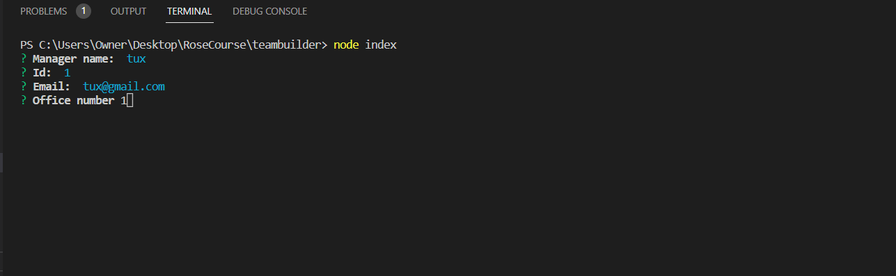
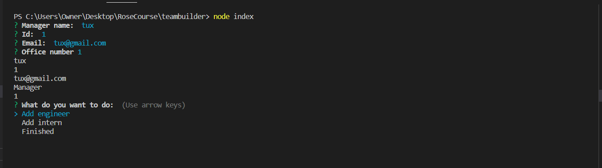
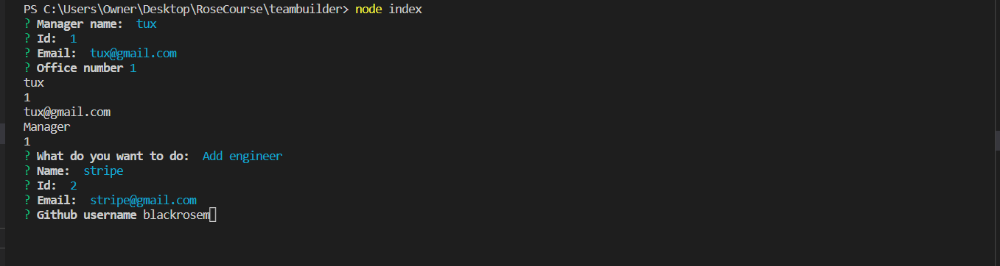
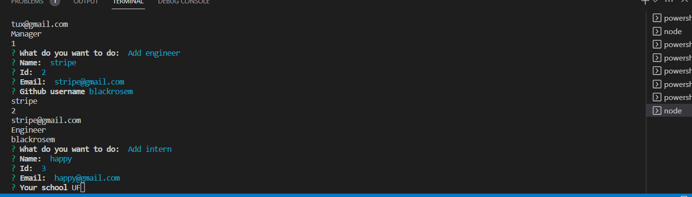
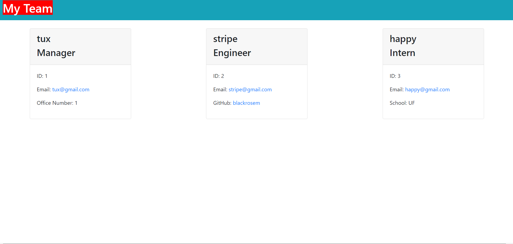

# teambuilder

## description
This program initially ask for the name, id, email, and office number of a manager.  The user is then asked whether they want to add an engineer, add an intern, or if they are finished.  Here is a [video](teambuilder.webm) detailing how it works.

[]

[]

If the user wants to add an engineer, they are asked for the name, id, email, and Github address.

[]

If the user wants to add an intern, they are asked for the name, id, email, and school.

[]

If the user indicates that they are finished, an HTML page is generated.

[]

### Skills
Node.js, inquirer, OOP